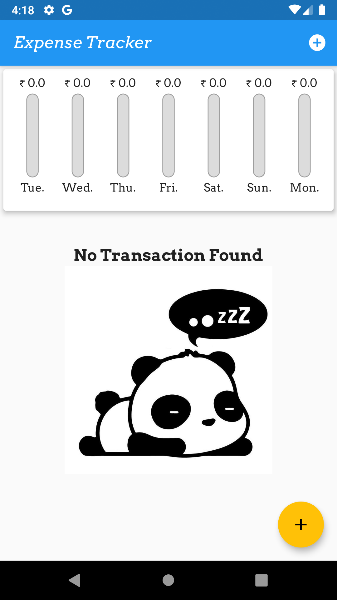

# Expense Tracker Application
Expense tracking 'On the Go' becomes a whole lot easier with this easy to use, intuitive and simple daily expense management application. 'Expense Tracker' helps you to manage your money 7 days a week, 24 hours a day.

💰 Expenses Tracker Application is a progressive android, ios, and web application 📉 written in Flutter Language. It is only a application that works great on any mobile devices 📱 of any screen size and can be deployed anywhere.

## Flutter Framework 
This project is a starting point for a Flutter application and Dart Language.

A few resources to get you started if this is your first Flutter project:
- [Lab: Write your first Flutter app](https://flutter.dev/docs/get-started/codelab)
- [Cookbook: Useful Flutter samples](https://flutter.dev/docs/cookbook)

For help getting started with Flutter, view our
[online documentation](https://flutter.dev/docs), which offers tutorials,
samples, guidance on mobile development, and a full API reference.

## Screenshots

## Expense Tracker

Steps to run 
'''
### 1. run the following command in terminal 

> git clone <>
> flutter create <Your Application Name>  
> start .

### 2. Copy lib, assests, pubspec.yaml folder from ExpenseTracker folder to <Your Application Name> folder

### 3. change directory to <Your Application Name>
> cd <Your Application Name>

### 4. Run the Application
> flutter run 

### 5. To Build Appliction 
> flutter build [apk/ios/web] 
 
## Features in this project:git push -u origin master

* Add New Transaction
* Delete Transaction
* Update Chart of each Transaction
* Responsiveness, Work on any devices 
* Even work in landscape mord
* Better UI

## Library Used  
| Attempt | #1  | 
| :---:   | :-: | 
| initl | [intl: ^0.16.1](https://pub.dev/packages/intl) | 

